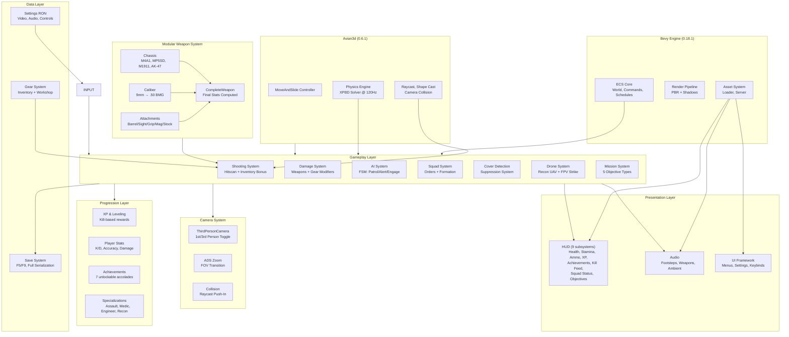

# Design Document

## 1. System Architecture (Current)



## 2. Entity Blueprints (Current)

### Player Entity

```
PlayerBundle
├── Player (marker)
├── Health (100 HP, no regen)
├── MovementState (Standing/Sprinting/Crouching/Prone)
├── WeaponSlot (Primary: M4A1 + Sidearm: M1911)
├── WeaponState (magazine, reserve, fire timer, reload)
├── OffhandWeaponState (sidearm ammo persistence)
├── WeaponBobState (bob phase for animation)
├── Stamina (100 max, drain/regen)
├── WeaponHandling (weight class, ADS time, deploy)
├── Breathing (hold breath for steadiness)
├── RigidBody::Kinematic
├── Collider::capsule(0.3, 0.9)
└── CharacterController (velocity-based movement)
```

### Enemy Entity

```
EnemyBundle
├── Team::Enemy
├── Health (80 HP)
├── AiState (Patrol/Alert/Engage)
├── VisionCone (120° FOV, 40m range, suspicion meter)
├── PatrolRoute (waypoints + wait timer)
├── WeaponState (AK-47, 30 rounds)
├── RigidBody::Kinematic
├── Collider::capsule(0.3, 0.9)
└── CharacterController
```

### Drone Entities

```
ReconDroneBundle / FpvDroneBundle
├── Drone
│   ├── drone_type (Recon | FpvStrike)
│   ├── battery (120 / 30 max)
│   ├── velocity (flight physics)
│   ├── marked_targets (recon)
│   ├── detonated (FPV)
│   ├── explosion_radius (8m)
│   └── explosion_damage (200)
├── RigidBody::Kinematic
├── Collider::sphere(0.3 / 0.1)
└── Transform
```

## 3. Weapon System Architecture (8 Files)

### Stat Computation

```
Final Stats = Chassis Base × Caliber Mult × Barrel Mult × Sight Mult × Grip Mult × Mag Mult × Stock Mult

Example M4A1 with Suppressor + Red Dot:
  Damage = 25.0 × 1.0 (5.56) × 0.9 (Suppressor) = 22.5
  Recoil = 0.8 × 1.0 (5.56) × 1.0 (Suppressor) × 1.0 (Standard Grip) × 1.0 (Standard Stock) = 0.8
  ADS Spread = 0.5 × 1.0 (5.56) × 0.85 (Red Dot) = 0.425°
  Weight = 3.5 + 0.4 (Suppressor) + 0.2 (Red Dot) = 4.1 kg
```

### Attachment Effects

| Slot | Options | Key Stats Modified |
|------|---------|-------------------|
| Barrel | Standard, Suppressor, Compensator, Extended, Short | Damage, Recoil, Spread, Range, Weight |
| Sight | Iron, RedDot, Holo, ACOG, SniperScope | ADS Spread, ADS Time, Zoom, Hip Spread |
| Grip | None, Vertical, Angled, Bipod | Vert/Horiz Recoil, Hip Spread, ADS Speed |
| Magazine | Standard, Extended, QuickDraw, Drum | Capacity, Reload Time, Weight, Speed |
| Stock | Standard, Folding, Precision, NoStock | Recoil, ADS Speed, Hip Spread, Sway |

## 4. Camera System Design

### Perspective States

| State | Activation | Behaviour |
|-------|-----------|-----------|
| Third Person | Default | Over-shoulder orbit, 6m distance, 70° FOV, shoulder swap (Q) |
| First Person | V key / Middle Mouse | Eye-level, 80° FOV, no orbit, weapon-only view |
| ADS (both) | Right-click hold | -15° FOV zoom, 0.5× spread multiplier, 0.7× speed multiplier |
| Freelook | Middle-mouse hold | Camera yaw/pitch frozen, movement continues in original direction |

### Perspective Transition

```
perspective_factor lerps 0.0→1.0 at PERSPECTIVE_LERP_SPEED (0.12/frame)
- At 0.0: Full 3rd person (orbit + shoulder + collision)
- At 1.0: Full 1st person (eye level, no orbit)
- Camera FOV = lerp(70°, 80°) + ADS_offset(-15° × ads_factor)
```

## 5. Drone System Design

### Recon Drone (U key)
- High altitude (8m default), moderate speed (8 m/s)
- Battery: 120 max, 3/s drain = 40s flight
- Auto-returns to player at 15% battery
- Camera-relative WASD + Q/E up/down

### FPV Strike Drone (J key)
- Low altitude (2m), fast (25 m/s)
- Battery: 30 max = 10s flight
- Manual detonation (Space) or proximity auto-detonate
- 200 damage in 8m radius with falloff
- One-time use, recharges faster (15/s)

### Grenade Drone (H key)
- Quadcopter with 4x fragmentation grenade hardpoints
- Flies to target waypoint, drops grenade on command
- Grenade: 3s parachute descent + 4s fuse after drop
- Drone: 10s flight time, 60 battery, 5 m/s speed
- Auto-returns after all grenades deployed
- Can be shot down (one hit, drone destroyed, remaining grenades detonate)
- Controls: same WASD as Recon. Press SPACE to drop grenade at current position

### Mine Drone (N key)
- Quadcopter with 3x AP mine dispenser
- Flies to designated area, deploys mines in configurable pattern
- Deploy patterns: LINE (3 mines spaced 5m), TRIANGLE (8m area cover), CIRCLE (5m perimeter)
- Drone: 8s flight time, 50 battery, 4 m/s speed
- Deployed mines: 2s arm time, same stats as hand-placed AP mines
- Destroy drone mid-flight to prevent mining (mines not yet deployed are lost)
- Controls: same WASD, tap G to cycle pattern, hold G to deploy at current position (up to 3)

### Drone Countermeasures
- All drones: one hit to destroy (any caliber)
- Destroyed drone drops from sky, falls to ground
- Enemy drones show on minimap when within 30m
- Recon drone: 0.3m collision radius, 8m altitude
- FPV drone: 0.1m radius, 2m altitude, fast = harder to hit
- Grenade drone: 0.3m radius, 6m altitude
- Mine drone: 0.3m radius, 4m altitude

## 5.6. Equipment System Architecture

### Component Model
```rust
#[derive(Component)]
pub enum EquipmentType {
    FragGrenade { fuse_timer: Timer, cooking: bool },
    SmokeGrenade { fuse_timer: Timer, cloud_radius: f32, duration: Timer },
    Flashbang { fuse_timer: Timer },
    StunGrenade { fuse_timer: Timer },
    ImpactGrenade { fuse_timer: Option<Timer> },
    Claymore { armed: bool, trigger_tripwire: Entity },
    APMine { armed: bool, triggered: bool },
    C4Charge { detonator_id: u8, placed: bool },
    ProximitySensor { range: f32, battery: Timer },
    CombatKnife { heavy_windup: f32 },
    ThrowingKnife { thrown: bool, embedded_in: Option<Entity> },
    Bandage { heal_amount: f32, use_time: f32 },
    Medkit { heal_amount: f32, use_time: f32 },
    Defibrillator { charge_time: f32 },
    SurgeryKit { heal_amount: f32, use_time: f32 },
}

#[derive(Resource)]
pub struct EquipmentInventory {
    pub throwables: Vec<EquipmentType>,   // G-tap cycle
    pub deployables: Vec<EquipmentType>,  // Deployed on ground
    pub melee: EquipmentType,             // Always equipped (knife)
    pub healing: Vec<EquipmentType>,      // Bandages/medkits
    pub selected_index: usize,            // Current throwable slot
}

#[derive(Component)]
pub struct DeployedEquipment {
    pub equipment: EquipmentType,
    pub owner: Entity,
    pub arm_timer: Option<Timer>,
    pub triggered: bool,
}
```

### Equipment Systems
| System | Description |
|--------|-------------|
| equipment_selection_system | G-tap cycles throwable/deployable index. H-press selects next healing item |
| equipment_throw_system | G-hold throws selected grenade with trajectory arc + fuse start |
| equipment_deploy_system | G-hold deploys selected equipment (claymore, mine, C4, sensor) at foot position |
| equipment_detonate_system | F-press detonates all placed C4 charges (in order placed) |
| equipment_trigger_system | Checks tripwire/pressure plate triggers, activates equipment effect |
| grenade_explosion_system | Handles frag/smoke/flash/stun/impact effects when fuse ends |
| melee_attack_system | V-key or scroll-wheel melee attack. Heavy attack held |
| throwing_knife_system | Throw projectile, retrieve from surfaces |
| healing_system | Hold H for self-heal, approach teammate + hold H for team-heal |
| defibrillator_system | Approach downed teammate, hold F, 4s charge audible to enemies |
| bleed_out_system | 30s timer after downed, headshots = instant death no timer |

## 5.7. Medic System Architecture

### Component Model
```rust
#[derive(Component)]
pub struct Health {
    pub current: f32,
    pub max: f32,
    pub armor: f32,                    // Damage reduction 0-1
    pub is_downed: bool,               // Bleeding out (can be revived)
    pub bleed_out_timer: Timer,        // 30s default
    pub instant_death: bool,           // Headshot = true, no revive
    pub healing_timer: Option<Timer>,  // Active healing progress
    pub damage_timer: Timer,           // Recent damage, blocks healing
}

#[derive(Resource)]
pub struct MedicSystemState {
    pub revive_distance: f32,           // 2m max for defib
    pub heal_distance: f32,             // 3m max for medkit/bandage
    pub bleed_out_time: f32,            // 30s default
    pub headshot_instant_death: bool,   // true
    pub damage_block_heal_time: f32,    // 2s after last damage
}
```

### Healing Sequences
| Action | Key | Condition | Result |
|--------|-----|-----------|--------|
| Self-bandage | Hold H | Not under fire, not moving, bandage in inventory | +25 HP over 3s, consume bandage |
| Self-medkit | Hold H (when no bandages) | Same + stationary/prone | +75 HP over 6s, consume medkit |
| Teammate heal | Approach + Hold H | Within 3m, not under fire | 1.5x speed, consume item |
| Teammate revive | Approach + Hold F | Within 2m, downed teammate, defib in inventory | 4s charge, defib consumed, +50 HP |

## 6. Progression System

### XP & Leveling
- 50 XP per kill
- Level formula: `xp_needed = level × 100`
- Level 2 = 100 XP, Level 3 = 200 XP, etc.
- Emits `XpGainedMessage` and `LevelUpMessage`

### Specializations
| Spec | Bonuses |
|------|---------|
| Assault | +15% damage, +10% sprint speed |
| Medic | +25% healing received, faster revives |
| Engineer | +20% ammo capacity, better gear effectiveness |
| Recon | +20% accuracy, enhanced detection range |

### Achievements
FirstBlood, DoubleTap, Survivor, Headhunter, Unstoppable, Gunsmith, Perfectionist

## 7. System Communication (Messages)

| Message | Source | Consumers |
|---------|--------|-----------|
| `DamageMessage` | shooting_system | apply_damage, stats, feedback |
| `DeathMessage` | death_check | player_death, stats, xp, effects |
| `WeaponFiredMessage` | shooting | stats |
| `HitConfirmedMessage` | shooting | hit_marker, audio |
| `XpGainedMessage` | xp system | HUD (XP bar) |
| `LevelUpMessage` | xp system | HUD (notification), gear unlock |
| `AchievementUnlockMessage` | achievement_checker | HUD (popup) |
| `SquadOrderMessage` | command_wheel | squad AI behaviors |
| `SquadStatusMessage` | squad AI | HUD (status display) |
| `CoverStateMessage` | cover_detection | movement, weapon |
| `SuppressionMessage` | suppression_system | feedback, weapon spread |
| `ItemPickupMessage` | loot system | inventory |
| `ItemEquipMessage` | gear UI | inventory, weapon stats |

## 8. File Map (68 Source Files)

```
crates/
├── core/src/        (3) lib, components, resources
├── input/src/       (3) lib, actions, bindings
├── rendering/src/   (2) lib, camera (1st/3rd person)
├── audio/src/       (3) lib, footsteps, ambient
└── game/src/
    ├── ai/          (3) mod, enemy, teammate
    ├── ammo_type/   (1) mod
    ├── breathing/   (1) mod
    ├── combat/      (8) mod, shooting, damage, death, reload, weapon_bob, weapon_model, weapon_state, impacts
    ├── controls/    (3) mod, stance, turn_rate
    ├── drones/      (1) mod
    ├── feedback/    (4) mod, hit_marker, vignette, enemy_fx
    ├── gear/        (5) mod, items, inventory, attachments, workshop
    ├── hud/         (9) mod, elements, systems, xp_notification, stamina_bar, achievement_popup, kill_feed, squad_status
    ├── menu/        (3) mod, settings, keybinds
    ├── missions/    (1) mod
    ├── physics/     (5) mod, player_movement, enemy_movement, stance, layers
    ├── progression/ (5) mod, xp, stats, achievements, specializations
    ├── squad/       (3) mod, orders, formation
    ├── stamina/     (1) mod
    ├── states/      (4) mod, main_menu, loading, ingame
    ├── tactical/    (3) mod, command_wheel, cover, suppression
    ├── weapon_handling/ (1) mod
    ├── weapons/     (8) mod, chassis, caliber, barrel, sight, underbarrel, magazine, stock
    └── (root)      (10) main, player, level, messages, pause, console, camera_control, settings, settings_applier, save_load
```

## 9. Game Mode Architecture

### 9.1 Round Manager (Shared)
```
MatchManager (Resource)
├── mode: GameMode (TDM | Demolition | CTF | Training)
├── state: MatchState (Warmup | BuyPhase | Active | RoundEnd | MatchEnd)
├── round_number: u8 (1-9)
├── round_time: Timer (5-6 min)
├── scores: [TeamScores; 2]
├── team_players: [Vec<Entity>; 2]
└── status: MatchStatus (InProgress | Halftime | Finished)

RoundFlow:
  Warmup (5s) -> BuyPhase (15s) -> Active (5-6m) -> RoundEnd (8s) -> next round or MatchEnd
```

### 9.2 Win Condition Logic
```
TDM:  All enemies eliminated OR most alive when timer expires
Demo: Bomb detonated (Attacker) OR bomb defused/time expired (Defender)
CTF:  Flag captured at base OR all enemies eliminated
```

### 9.3 Economy System
```
Starting money: 2000 (first round), 800 (after loss streak reset)
Kill bonus: 300 per kill
Win bonus: 1500 per round
Loss bonus: 2000 (increasing if consecutive losses)
Bomb plant: 300 (attacker), Bomb defuse: 500 (defender)
```

## 10. Network Architecture (Phase 6)

```
Client                               Server
  |                                     |
  |--- Connection Request (TCP) ------->|
  |<-- Connection Accepted (TCP) -------|
  |--- Player Auth (Token/Steam) ------>|
  |<-- Auth OK + Profile Data ----------|
  |                                     |
  |=== UDP Game Connection Established ===|
  |                                     |
  |--- Input State (20-60 ticks/s) ---->|
  |                                     |  Server runs fixed timestep
  |                                     |  Processes input, physics, damage
  |<-- World State (interpolated) ------|
  |<-- Entity Spawns/Despawns ----------|
  |<-- Event Messages (kill, damage) ---|
  |                                     |
  Client Prediction:                   Server Authority:
  - Movement predicted locally         - Final position on server
  - Hit reg guessed locally            - Server confirms/rejects hits
  - Visual interpolation of others     - Physics on fixed timestep
```

### 10.1 Replicated Components
| Component | Server Authoritative | Client Predicted | Interpolated |
|-----------|---------------------|------------------|--------------|
| Transform | Yes | Yes | Yes |
| Health | Yes | No | No |
| WeaponState | Yes | No | Yes |
| MovementState | Yes | Yes | Yes |
| CharacterController | Yes | Yes | No |

## 11. Build Configuration

| Setting | Value | File |
|---------|-------|------|
| Physics timestep | 120Hz fixed | main.rs via Time<Fixed> |
| Dev tools | FPS overlay + World Inspector (F1) | main.rs |
| VFX | bevy_hanabi 0.18.0 | VfxPlugin in combat/vfx.rs |
| Loading screen | iyes_progress 0.17.0-rc.1 | main.rs (wired, inactive) |
| Asset formats | bevy_common_assets 0.17.0-rc.1 | main.rs (in deps) |

## 12. VFX System Architecture

### 12.1 Particle Effects (bevy_hanabi 0.18.0)

Five effects are registered in `combat/vfx.rs` via the `VfxPlugin`:

| Effect | Particles | Lifetime | Color | Size | Trigger |
|--------|-----------|----------|-------|------|---------|
| MuzzleFlash | 64 | 0.1s | Yellow→Orange→Transparent | 0.3→0.6→0.05 | WeaponFiredMessage |
| BulletImpact | 32 | 0.25s | White-Orange→Transparent | 0.08→0.12→0.02 | HitConfirmedMessage(hit=true) |
| HitMarker | 8 | 0.12s | Full Red→Transparent | 0.15→0.02 | DamageMessage |
| DeathExplosion | 6 | 1.0s | Orange→Red→Transparent | 0.5→1.0→0.1 | DeathMessage + gravity(-5) |
| Tracer | 16 | 0.3s | Yellow-Green→Orange→Transparent | 0.1→0.02 | WeaponFiredMessage(miss) |

### 12.2 System Flow

```
Message → VFX System → ParticleEffect entity → Cleanup (VfxEffect timer)
```

All effects use:
- `SpawnerSettings::once()` for single-burst emission
- `ColorOverLifetimeModifier` with `Gradient<Vec4>` for color interpolation
- `SizeOverLifetimeModifier` with `Gradient<Vec3>` for size interpolation
- `VfxEffect` component with `Timer` for entity cleanup after effect completes

### 12.3 Post-Processing Stack

Applied to the camera entity at spawn (`player.rs`):
- `Tonemapping::AcesFitted` — ACES filmic tone mapping (AAA standard)
- `Bloom::default()` — bloom for bright effects (muzzle flash, explosions)
- `PostProcessingProfile` — intensity multiplier (future expansion)

Post-processing is confirmed by `apply_post_processing_system` in `rendering/src/post_processing.rs`.

## 13. Destruction & Damage System Architecture

### 13.1 Damage State Machine

```rust
// Per-destructible-entity component
#[derive(Component)]
pub struct DestructionState {
    pub state: DestructionLevel,      // 0=Pristine, 1=Damaged, 2=Breached, 3=Destroyed
    pub health: f32,                    // Current structural HP
    pub max_health: f32,               // Per material type
    pub material: MaterialType,        // Concrete, Wood, Metal, Glass, etc.
    pub bullet_holes: Vec<Vec3>,       // Accumulated impacts (max 64)
    pub crater_mask: u32,              // Bitmask of major damage zones
    pub has_debris: bool,              // Whether spawned debris
}

pub enum MaterialType {
    Concrete { thickness: f32, reinforced: bool },
    Wood { thickness: f32 },
    SheetMetal { thickness: f32 },
    Glass { thickness: f32 },
    Brick { thickness: f32 },
    Sandbag,    // -- no penetration, degrades
    Tire,
    Flesh,
}

impl DestructionState {
    pub fn apply_bullet_impact(&mut self, caliber: f32, position: Vec3) -> DamageEvent {
        // 1. Add bullet hole
        // 2. Check penetration threshold vs material thickness
        // 3. If penetrated, create exit hole and damage behind
        // 4. Reduce health by caliber-based damage
        // 5. If health < threshold, advance destruction state
        // 6. Return DamageEvent for FX system
    }
    
    pub fn apply_explosion(&mut self, force: f32, radius: f32, position: Vec3) -> DamageEvent {
        // 1. Create spherical damage falloff
        // 2. If force > structural threshold, breach/create hole
        // 3. Spawn debris particles
        // 4. Propagate structural damage to connected entities
        // 5. If health = 0, trigger collapse/destroyed state
    }
}
```

### 13.2 Material Penetration Table

| Material | Thickness | 5.56mm | 7.62mm | .50 BMG | 9mm | .45 ACP | 12ga Slug |
|----------|-----------|--------|--------|---------|-----|---------|-----------|
| Drywall | 1.3cm | Penetrate | Penetrate | Penetrate | Penetrate | Penetrate | Penetrate |
| Wood (pine) | 3.8cm | Penetrate | Penetrate | Penetrate | Stop | Stop | Penetrate |
| Plywood | 1.9cm | Penetrate | Penetrate | Penetrate | Penetrate | Penetrate | Penetrate |
| Sheet metal | 0.16cm | Penetrate | Penetrate | Penetrate | Penetrate | Penetrate | Penetrate |
| Brick | 10cm | Stop | Stop | Penetrate | Stop | Stop | Stop |
| Concrete | 20cm | Stop | Stop | Penetrate | Stop | Stop | Stop |
| Concrete (reinforced) | 30cm | Stop | Stop | Stop | Stop | Stop | Stop |
| Sandbag | 45cm | Stop | Stop | Penetrate | Stop | Stop | Stop |
| Car door | 0.1cm | Penetrate | Penetrate | Penetrate | Penetrate | Penetrate | Penetrate |
| Car engine block | 20cm | Stop | Stop | Stop | Stop | Stop | Stop |
| Bulletproof glass | 3.8cm | Stop | Stop | Penetrate | Stop | Stop | Stop |

### 13.3 Structural Health Values

| Structure | Max HP | Breach Threshold | Collapse Threshold | Repair? |
|-----------|--------|------------------|-------------------|---------|
| Drywall wall (4m x 2.4m) | 200 | 100 (2m hole) | 0 (full collapse) | No |
| Concrete wall (4m x 2.4m) | 2000 | 500 (1m crater) | 0 | No |
| Reinforced wall | 5000 | 1500 | 0 | No |
| Wooden door | 100 | 50 (breached open) | 0 | No |
| Metal door | 300 | 150 | 0 | No |
| Window glass | 30 | 20 (shattered) | 0 | No |
| Sandbag stack | 500 | 250 (sand leak) | 0 | No |
| Wooden crate | 50 | 25 (splintered) | 0 | No |
| Metal barrel | 100 | 50 (ruptured) | 0 | No |
| Car | 500 | 250 (disabled) | 0 (wreck) | No |
| Helicopter | 1000 | 500 (disabled) | 0 (crash) | No |
| Tree | 200 | 100 (damaged) | 0 (fallen) | No |
| Street lamp | 150 | 75 (bent) | 0 (fallen) | No |

### 13.4 Debris System

| Debris Type | Spawned From | Count | Lifetime | Physics |
|-------------|-------------|-------|----------|---------|
| Concrete chunk | Wall breach/collapse | 5-20 | 30s | Falling + rolling + settle |
| Brick fragment | Brick wall damage | 10-30 | 30s | Falling + bouncing |
| Wood splinter | Crate/door/fence destruction | 5-15 | 20s | Light, scattered by explosion impulse |
| Metal scrap | Barrel/vehicle destruction | 3-10 | 60s | Heavy, slides + settles |
| Glass shard | Window break | 10-40 | 10s | Sprays outward, gravity, settle |
| Dust cloud | Any concrete/brick destruction | 1 per event | 3-5s | Expands upward, fades by alpha |
| Rebar section | Reinforced concrete breach | 2-4 | Permanent | Bent, sticking out of breach hole |
| Tire fragment | Tire destruction | 2-4 | 30s | Flops + settles |

### 13.5 Destruction Performance Budget

| Metric | Limit |
|--------|-------|
| Max bullet holes rendered | 500 total |
| Max destruction state changes per frame | 10 |
| Max active debris entities | 200 |
| Max damaged asset billboards | 50 (at LOD distance) |
| Building collapse animation time | 3-8 seconds |
| Debris cleanup interval | Clean debris > 30s old, every 5s |
| Damage state sync (networked) | Only sync state transitions, not bullet holes |
| Destruction audio cap | Max 3 destruction sounds simultaneously |

## 14. Design Ratings & Retrospective

| Aspect | Rating | Notes |
|--------|--------|-------|
| Modularity (crate separation) | 9/10 | Core has zero Bevy dep. Crates have clear boundaries |
| Code organization (files) | 8/10 | Most files under 200 lines. Some combat files could be split further |
| Message-driven communication | 9/10 | 14 messages for inter-system communication. No direct Event usage |
| Camera system | 8/10 | 1st/3rd person toggle + ADS. Collision works. Could use more smoothing |
| Weapon system | 9/10 | 8-file modular design with complete stat computation |
| Gear/progression | 7/10 | Systems exist but not fully integrated into gameplay feel |
| AI | 6/10 | FSM works but no navmesh, no flanking, no cover usage |
| HUD | 8/10 | 9 subsystems provide comprehensive feedback |
| Save/load | 7/10 | Works for progression data. No position/level state yet |
| Performance | 6/10 | 120Hz physics configured. No profiling or optimization done |
| Documentation | 6/10 | Spec files updated. More inline docs needed in code |
| Overall | 7.5/10 | Solid foundation. Needs assets, polish, and gameplay loop refinement |

## 12. Asset Pipeline Inventory

See requirements.md Section 12 for the COMPLETE asset inventory including:

| Category | Phase 3 Min | Full Game |
|----------|-------------|-----------|
| Character models | 4 | 10 |
| Character gear/outfits | 10 | 60 |
| Weapon component files | 60 | 225+ |
| Drone files | 4 | 8 |
| Vehicle models | 0 | 20 |
| Modular tiles | 30 | 80 |
| Building kits | 3 | 10 |
| Environment props | 20 | 50 |
| Natural environment | 20 | 55 |
| Decals | 15 | 45 |
| Audio files | 80 | 390+ |
| VFX particles | 20 | 75 |
| Animation clips | 30 | 120 |
| UI textures | 40 | 135 |
| **Grand total** | **~336 assets** | **~1,283 assets** |

### Asset Pipeline Priority (Blender MCP Order)

| Priority | Assets | Why First |
|----------|--------|-----------|
| P0 | Player character, M4A1 base, concrete tile, barrel crate | Core gameplay |
| P1 | 2 enemies, teammate, AK-47, MP5SD, M1911 + attachments | Full combat |
| P2 | Footstep/weapon/ambient audio, muzzle flash VFX | Audiovisual feedback |
| P3 | Building kits, props, decals, trees, rocks | Level variety |
| P4 | All attachments (22 models), gear (13 types) | Gunsmith/workshop |
| P5 | Vehicles (technical, Humvee, heli) | Vehicle gameplay |
| P6 | Full animation set (120 clips) | Character immersion |
| P7 | Voice assets (184 files), UI textures (135 files) | Production polish |
| P8 | DLC weapons, event cosmetics | Post-launch content |
