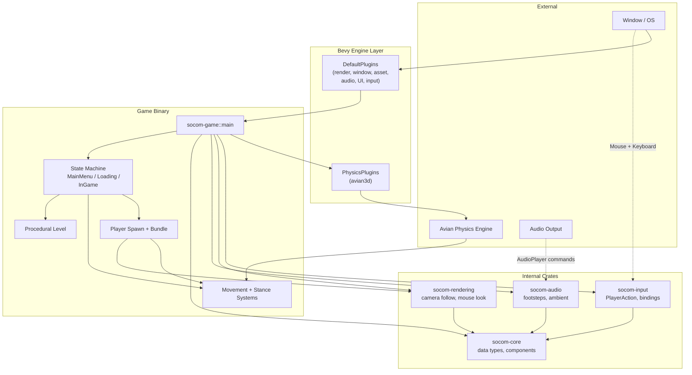
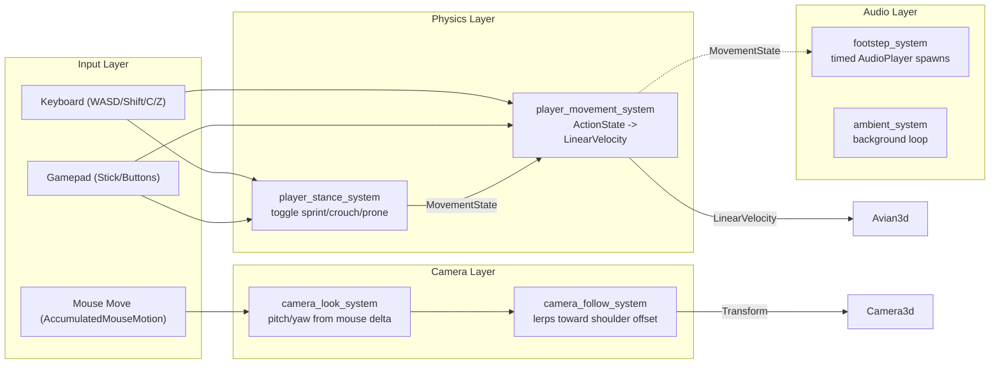
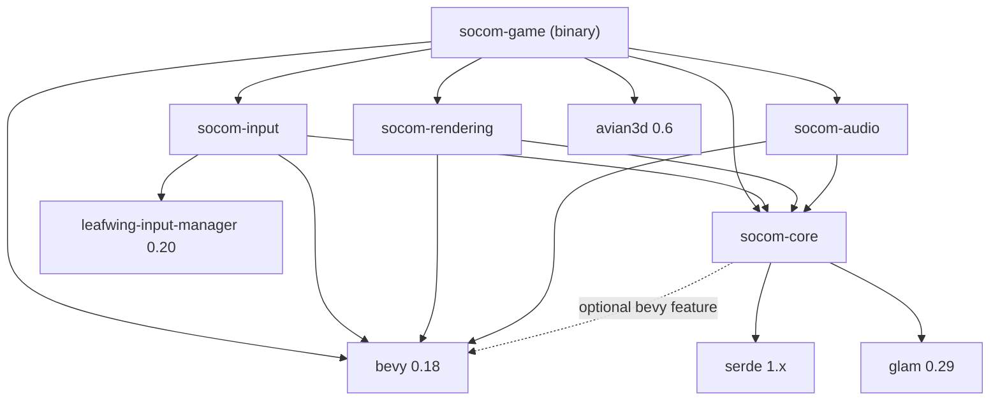
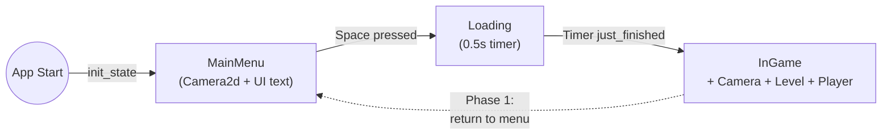

# Architecture

SOCOM Tactical Shooter is structured as a **layered ECS application** on top of the Bevy game engine. The Cargo workspace splits responsibilities into five crates with a strict dependency direction: `core` → `input`, `rendering`, `audio` → `game`.

## System Architecture

## Component / Data Flow

## Crate Dependency Graph

**Key rule:** `socom-core` must never depend on Bevy. All other crates depend on `core` with `features = ["bevy"]` to derive `Component` on its types.

## State Machine

States are defined as `AppState` enum with `States` derive from `bevy_state`.

## Key Design Decisions

1. **Core stays pure** — `socom-core` has zero Bevy dependency. The optional `"bevy"` feature gates `bevy_ecs::Component` derives via `#[cfg_attr(feature = "bevy", ...)]`. This allows core types to be shared with non-Bevy systems (server, editor, CLI tools).
2. **Action-based input** — Using `leafwing-input-manager`, all player actions are defined as an enum variant (`PlayerAction::Sprint`, `PlayerAction::Crouch`). The input map binds physical keys/buttons to actions, decoupling game logic from hardware.
3. **Third-person camera is a component** — `ThirdPersonCamera` is an ECS component attached to the camera entity. It stores its target entity, pitch/yaw angles, shoulder side, and lerp factor. Two systems (follow + look) process it independently.
4. **Physics via LinearVelocity** — Phase 0 uses direct `LinearVelocity` manipulation on a `RigidBody::Dynamic` entity. Phase 1 will switch to Avian's `KinematicCharacterController` + `MoveAndSlide` for proper stair/ramp handling.
5. **Bevy 0.18 audio patterns** — No `Res<Audio>`; audio is spawned as entities: `commands.spawn((AudioPlayer::new(handle), PlaybackSettings::ONCE, ...))`.
