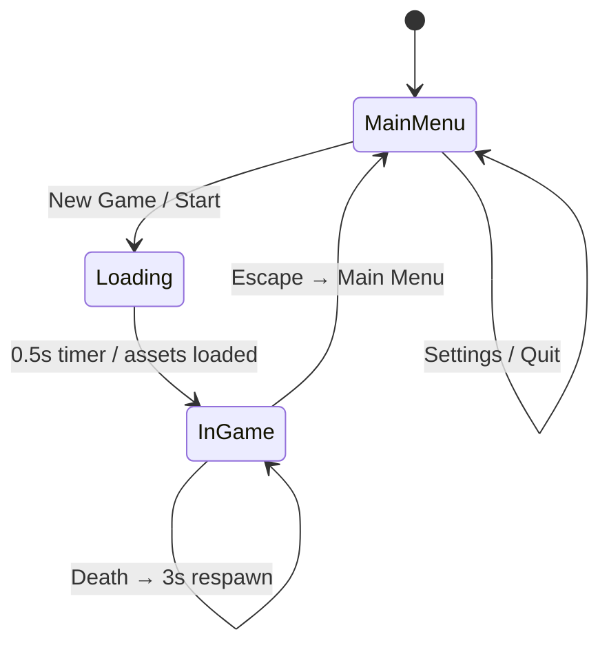
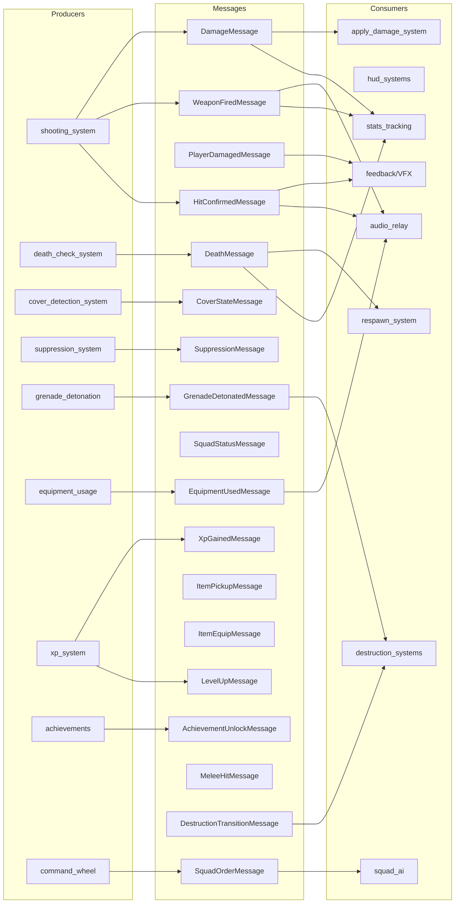
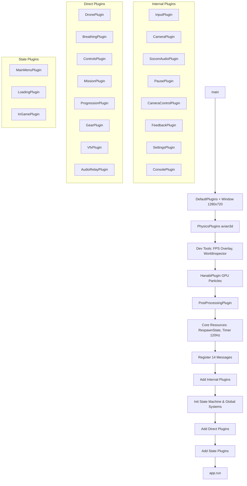

# SOCOM Tactical Shooter — System Architecture

## Overview

SOCOM Tactical Shooter is a 3rd/1st-person tactical shooter built in **Rust** with **Bevy 0.18.1**, **avian3d 0.6.1** physics, and **leafwing-input-manager 0.20**. It uses a **multi-crate Cargo workspace** with 5 crates and 100+ source files across 16 game module directories.

## Crate Dependency Graph

```
┌─────────────────────┐
│  game (binary)      │  88+ files, 16 module dirs
│  Bevy 0.18.1        │  gameplay, AI, combat, gear, HUD, physics, etc.
└─────┬───┬───┬───┬───┘
      │   │   │   │
      ▼   ▼   ▼   ▼
┌──────────┐ ┌──────────┐ ┌──────────────┐ ┌───────────┐
│ core     │ │ input    │ │ rendering    │ │ audio     │
│ (lib)    │ │ (lib)    │ │ (lib)        │ │ (lib)     │
│ 3 files  │ │ 3 files  │ │ 2 files      │ │ 4 files   │
│ pure     │ │ leafwing │ │ camera rig   │ │ bevy_audio│
│ data     │ │ bindings │ │ post-process │ │ + kira    │
│ types    │ │          │ │              │ │ 0.12 host │
└──────────┘ └──────────┘ └──────────────┘ └───────────┘
      │
      ▼  (no Bevy dep)
  serde + glam (only)
```

### Dependency Rules

- **`core`** must never depend on Bevy. All other crates depend on `core` with `features = ["bevy"]` to derive `Component` on its types.
- **`game`** depends on all four other crates + Bevy 0.18.1, avian3d 0.6.1, leafwing 0.20.
- **`input`** depends on bevy 0.18.1, leafwing 0.20, and core.
- **`rendering`** depends on bevy 0.18.1, core, input, avian3d 0.6.1.
- **`audio`** depends on bevy 0.18.1, core, kira 0.12.

## Crate Responsibilities

| Crate | Files | Purpose | Key Exports |
|-------|-------|---------|-------------|
| `core` | 3 | Pure data types, zero Bevy dep | `Player`, `Health`, `Weapon`, `WeaponSlot`, `MovementState`, `Team`, `Shoulder`, `GameSettings`, `InputMapping`, `Paused`, `SensitivityMultiplier` |
| `input` | 3 | leafwing-input-manager bindings | `PlayerAction` (17 variants), `InputPlugin`, `default_input_map()` |
| `rendering` | 2 | Camera rig + post-processing | `ThirdPersonCamera`, `CameraPlugin`, `PostProcessingPlugin`, `PerspectiveState` |
| `audio` | 4 | bevy_audio + kira standalone host | `AudioPlugin`, `KiraAudioState`, `FootstepPlugin`, `AmbientPlugin` |
| `game` | 88+ | Everything gameplay. Binary crate. | 16 module directories + 10 root files |

## Game Module Map (16 directories)

| Directory | Files | Purpose |
|-----------|-------|---------|
| `combat/` | 10 | shooting, damage, death, reload, weapon_bob, weapon_model, weapon_state, vfx, impacts, destruction |
| `weapons/` | 8 | chassis, caliber, barrel, sight, underbarrel, magazine, stock, CompleteWeapon |
| `gear/` | 10 | items, inventory, attachments, workshop, throwable, deployable, melee, equipment_types, equipment_inventory, healing |
| `hud/` | 9 | elements, systems, xp_notification, stamina_bar, achievement_popup, kill_feed, squad_status, mod |
| `physics/` | 5 | player_movement, enemy_movement, stance, layers, mod |
| `ai/` | 3 | mod, enemy (FSM), teammate |
| `squad/` | 3 | mod, orders (command dispatch), formation |
| `tactical/` | 4 | mod, command_wheel, cover, suppression |
| `drones/` | 1 | Recon UAV, FPV Strike, Grenade Drone, Mine Drone |
| `progression/` | 5 | xp, stats, achievements, specializations, mod |
| `controls/` | 3 | mod, stance (transition timers), turn_rate |
| `states/` | 4 | mod, main_menu, loading, ingame |
| `menu/` | 3 | mod, settings, keybinds |
| `feedback/` | 4 | hit_marker, vignette, enemy_fx, mod |
| `missions/` | 1 | MissionState resource, 5 objective types |
| `stamina/` | 1 | Stamina drain/regen + sway/spread penalties |
| `weapon_handling/` | 1 | WeaponWeight (Light/Medium/Heavy/Sniper) |
| `ammo_type/` | 1 | AmmoType enum (FMJ/HP/AP/Tracer) |
| `breathing/` | 1 | Hold-breath system |
| `audio_relay/` | 1 | Game message → kira audio bridge |
| `destruction/` | 6 | Material penetration, debris, glass, vehicles, collapse |
| **(root)** | 10 | main, player, level, messages, pause, console, camera_control, settings, settings_applier, save_load |

## State Machine



States are defined in `crates/game/src/states/mod.rs` as `AppState` enum:

- `MainMenu` — title screen with New Game, Settings, Quit
- `Loading` — asset loading phase with progress bar
- `InGame` — active gameplay with all systems running

## Message Bus Architecture

The game uses Bevy **Messages** (not Events) with 18 message types:



## All 18 System Messages

| Message | Source → Consumer |
|---------|------------------|
| `DamageMessage` | shooting → damage, stats, feedback, destruction |
| `DeathMessage` | death_check → player_death, stats, xp, effects |
| `WeaponFiredMessage` | shooting → stats, audio, VFX |
| `PlayerDamagedMessage` | damage → vignette, suppression |
| `HitConfirmedMessage` | shooting → hit_marker, audio, VFX |
| `XpGainedMessage` | xp system → HUD |
| `LevelUpMessage` | xp system → HUD, gear unlock |
| `AchievementUnlockMessage` | achievements → HUD popup |
| `SquadOrderMessage` | command_wheel → squad AI |
| `SquadStatusMessage` | squad AI → HUD |
| `CoverStateMessage` | cover_detection → movement, weapons |
| `SuppressionMessage` | suppression → feedback, weapons |
| `ItemPickupMessage` | loot → inventory |
| `ItemEquipMessage` | gear UI → inventory, weapons |
| `EquipmentUsedMessage` | equipment → feedback, audio |
| `GrenadeDetonatedMessage` | grenade → damage, destruction |
| `MeleeHitMessage` | melee → feedback, stats |
| `DestructionTransitionMessage` | destruction → FX, audio |

## App Startup Flow (main.rs)



## Key Technology Versions

| Dep | Version | Notes |
|-----|---------|-------|
| bevy | **0.18.1** | Pinned across ALL crates |
| avian3d | **0.6.1** | Physics + character controller |
| leafwing-input-manager | 0.20.x | Input abstraction |
| serde + ron | 1.x / 0.12 | Serialization |
| kira | 0.12 | Audio middleware (standalone) |
| bevy_hanabi | 0.18.0 | GPU particles |
| bevy_replicon | 0.41.0-rc.1 | Networking (Phase 6) |
| lightyear | 0.26.4 | Rollback networking (Phase 6) |
| bevy-inspector-egui | 0.36.0 | Runtime entity inspector |
| iyes_progress | 0.17.0-rc.1 | Loading screen |
