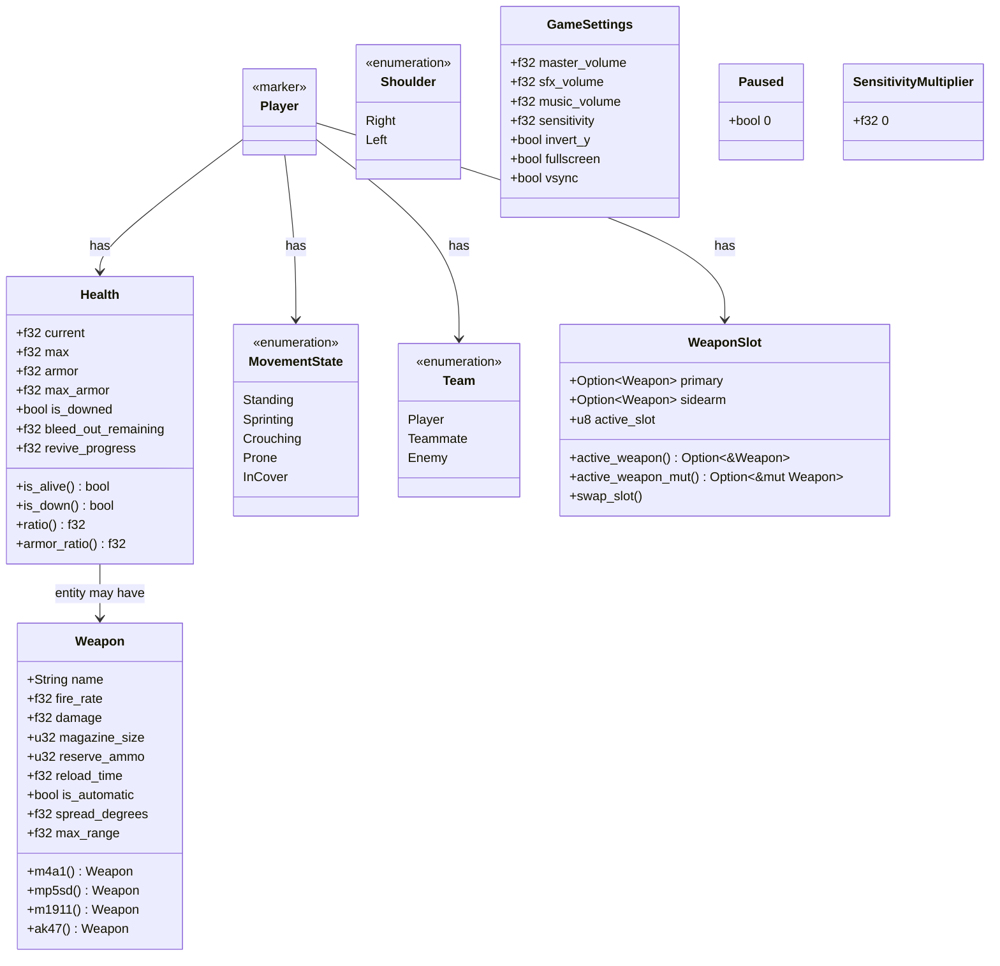
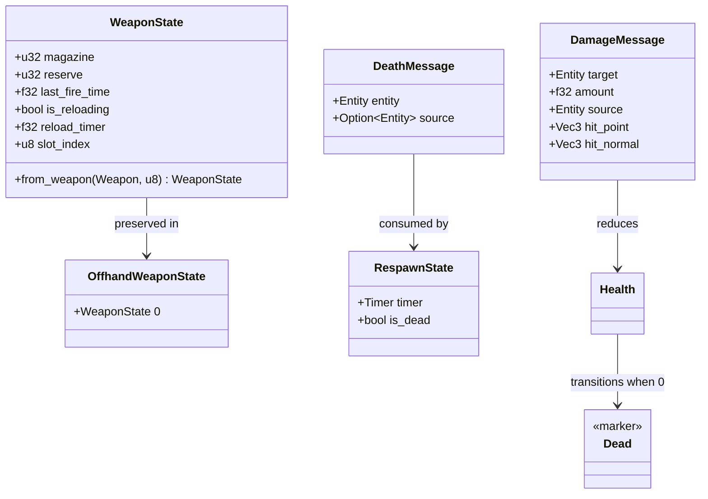
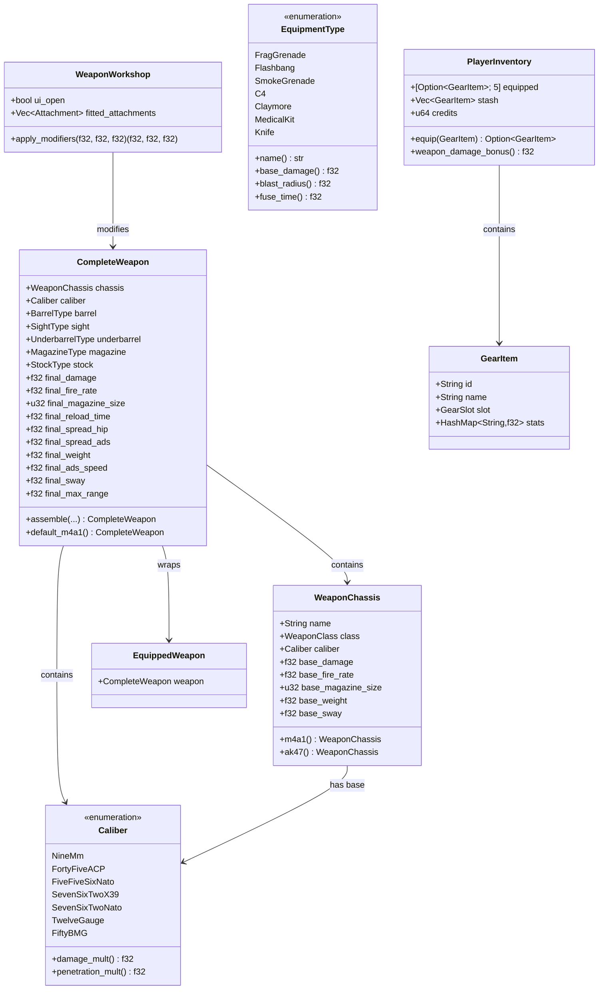
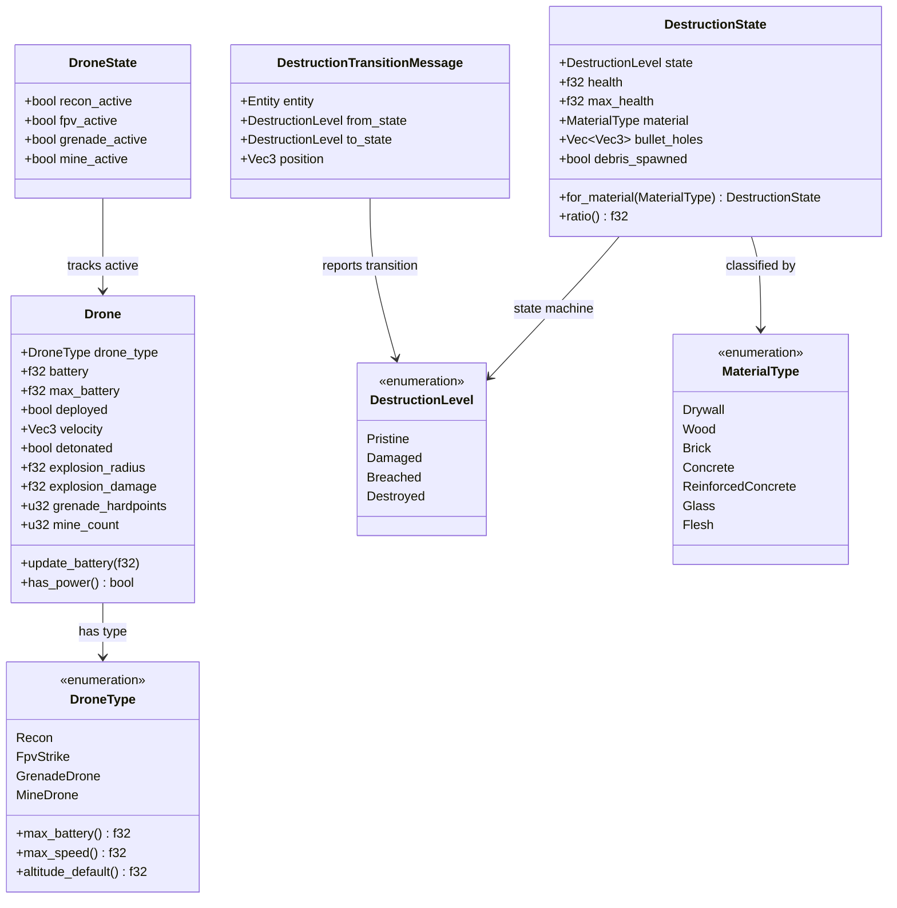
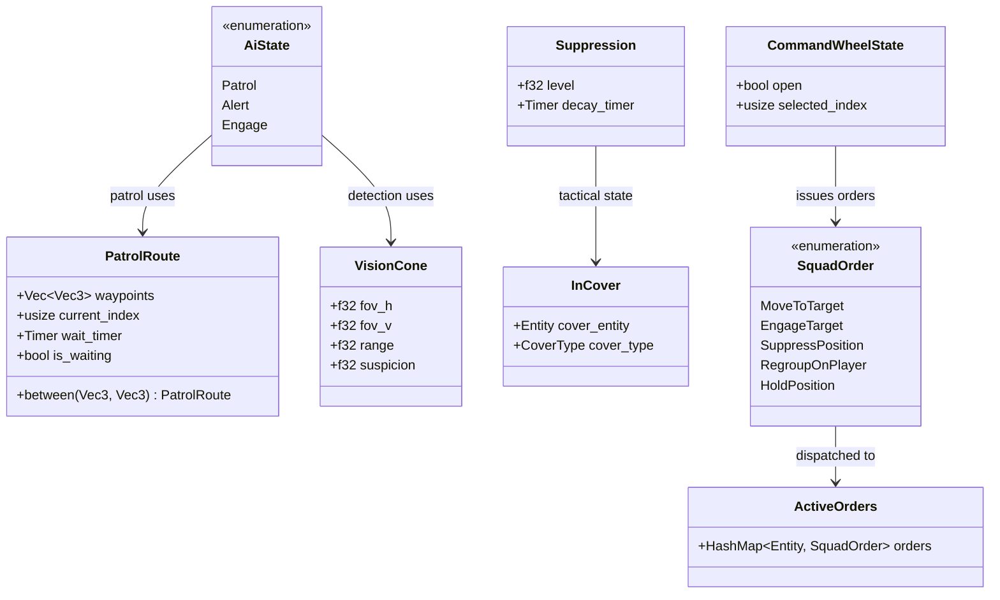
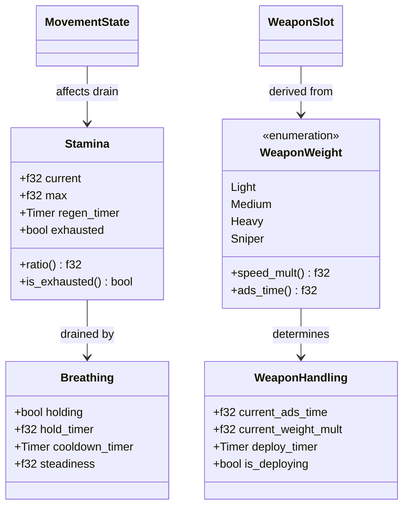

# SOCOM Tactical Shooter — Class Diagrams

## Core Type Hierarchy

## Combat Type Hierarchy

## Weapons & Gear Type Hierarchy

## Drone & Destruction Type Hierarchy

## AI & Squad Type Hierarchy

## Stamina & Weapon Handling

