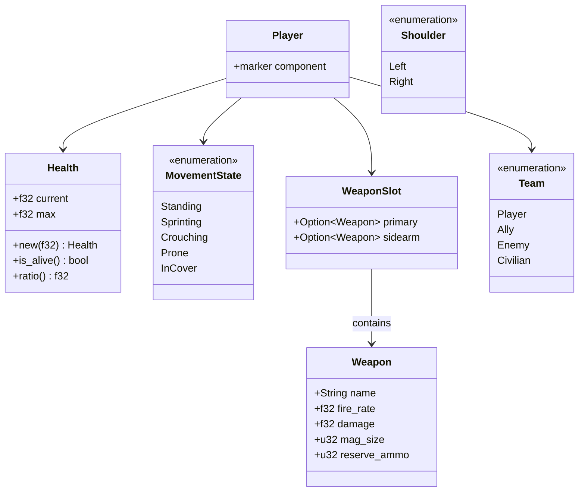
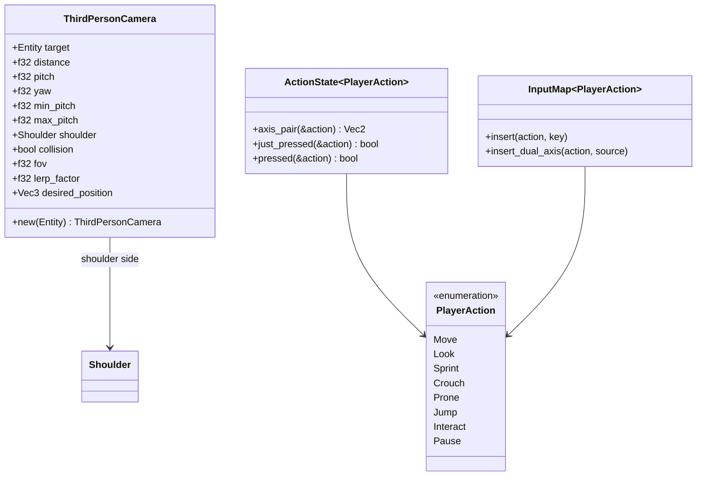
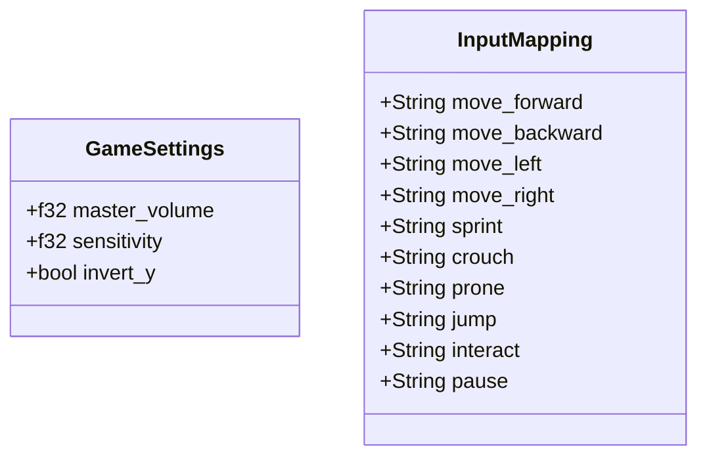

# Class Diagram — Core ECS Types

## Core Component Hierarchy

```mermaid
classDiagram
    class Player {
        +marker component
    }
    class Health {
        +f32 current
        +f32 max
        +new(f32) Health
        +is_alive() bool
        +ratio() f32
    }
    class MovementState {
        <<enumeration>>
        Standing
        Sprinting
        Crouching
        Prone
        InCover
    }
    class Weapon {
        +String name
        +f32 fire_rate
        +f32 damage
        +u32 mag_size
        +u32 reserve_ammo
    }
    class WeaponSlot {
        +Option~Weapon~ primary
        +Option~Weapon~ sidearm
    }
    class Shoulder {
        <<enumeration>>
        Left
        Right
    }
    class Team {
        <<enumeration>>
        Player
        Ally
        Enemy
        Civilian
    }

    Player --> Health
    Player --> MovementState
    Player --> WeaponSlot
    Player --> Team
    WeaponSlot --> Weapon : contains
```

## Camera + Input Types

```mermaid
classDiagram
    class ThirdPersonCamera {
        +Entity target
        +f32 distance
        +f32 pitch
        +f32 yaw
        +f32 min_pitch
        +f32 max_pitch
        +Shoulder shoulder
        +bool collision
        +f32 fov
        +f32 lerp_factor
        +Vec3 desired_position
        +new(Entity) ThirdPersonCamera
    }
    class PlayerAction {
        <<enumeration>>
        Move
        Look
        Sprint
        Crouch
        Prone
        Jump
        Interact
        Pause
    }
    class InputMap~PlayerAction~ {
        +insert(action, key)
        +insert_dual_axis(action, source)
    }
    class ActionState~PlayerAction~ {
        +axis_pair(&action) Vec2
        +just_pressed(&action) bool
        +pressed(&action) bool
    }

    ThirdPersonCamera --> Shoulder : shoulder side
    ActionState --> PlayerAction
    InputMap --> PlayerAction
```

## Game Resources

```mermaid
classDiagram
    class GameSettings {
        +f32 master_volume
        +f32 sensitivity
        +bool invert_y
    }
    class InputMapping {
        +String move_forward
        +String move_backward
        +String move_left
        +String move_right
        +String sprint
        +String crouch
        +String prone
        +String jump
        +String interact
        +String pause
    }
```
