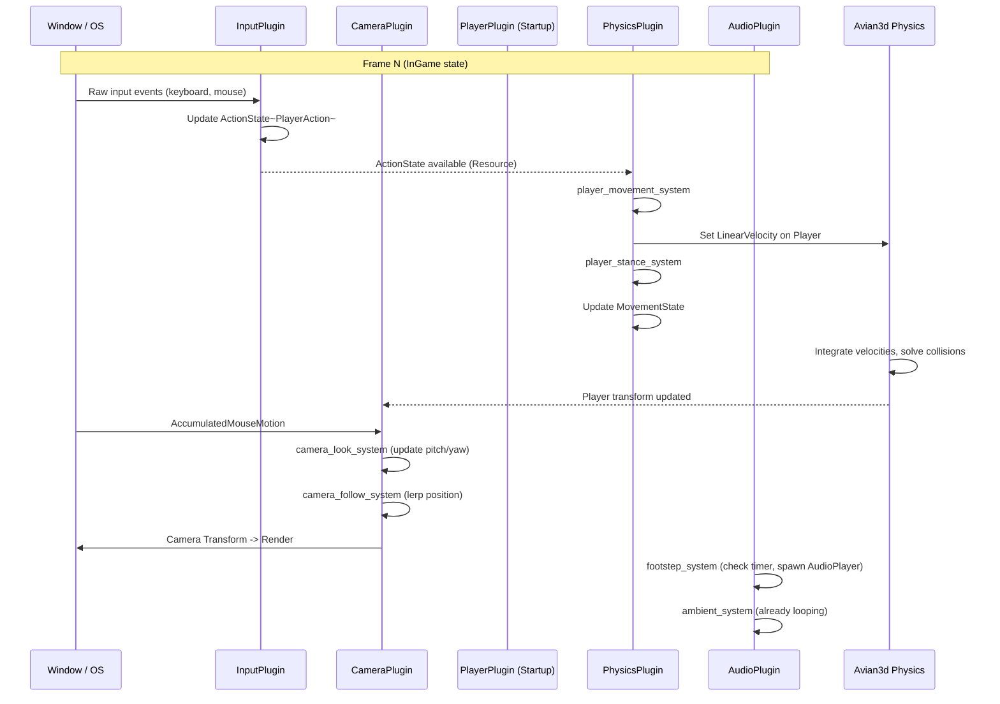
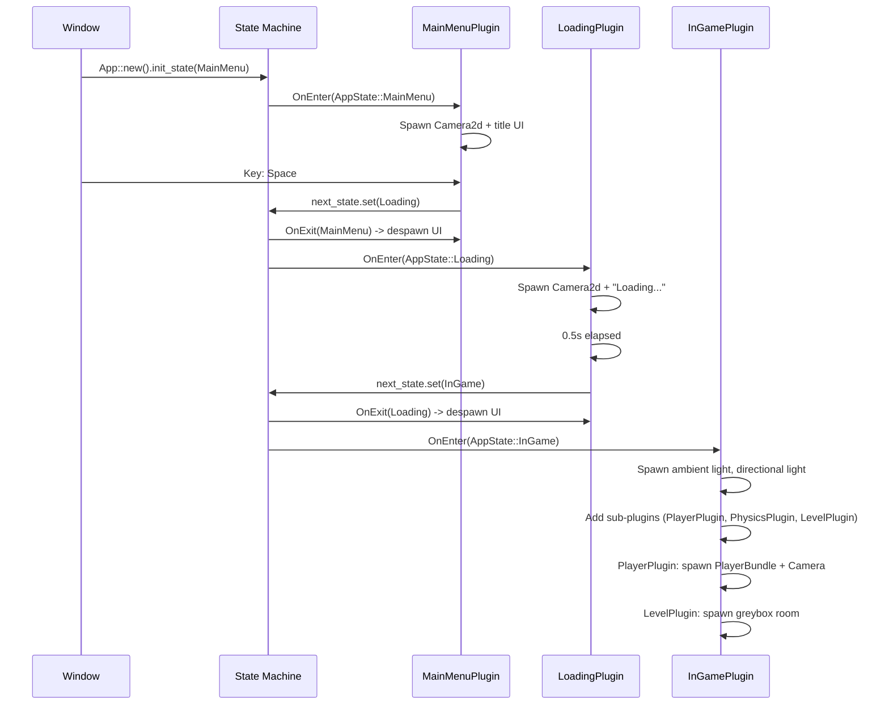
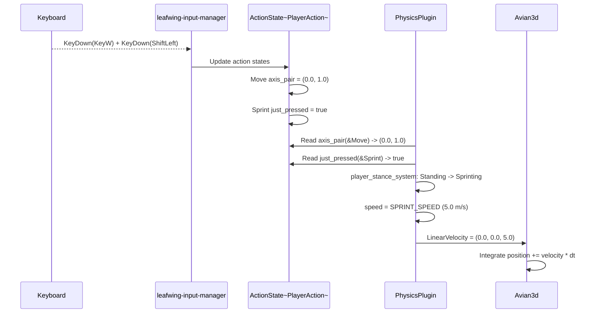
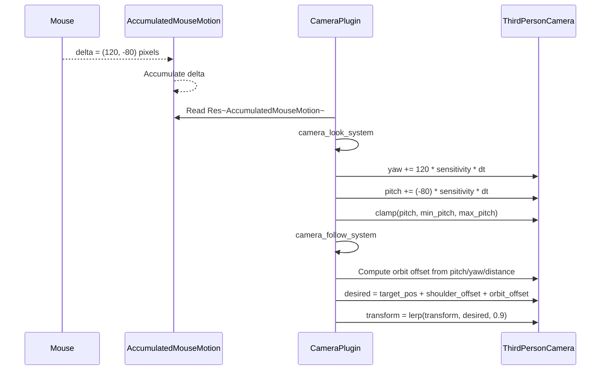

# Sequence Diagrams

## 1. Game Frame Lifecycle

Shows the order of systems executing per frame during `InGame` state.

## 2. State Transition: Menu to InGame

## 3. Input → Movement Pipeline

## 4. Camera Orbit

