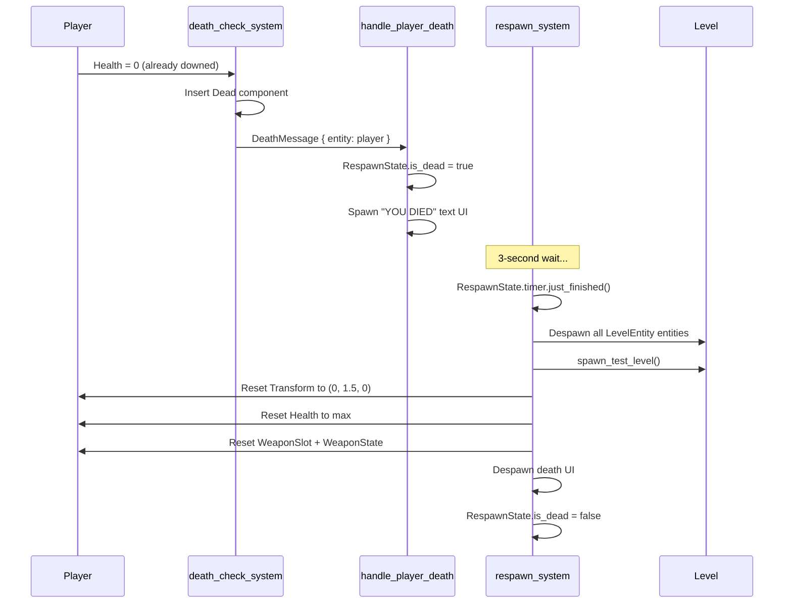

# Game Module: `combat/` — Combat Systems

**Path:** `crates/game/src/combat/`  
**Files:** 10 — `mod.rs`, `shooting.rs`, `damage.rs`, `death.rs`, `reload.rs`, `weapon_state.rs`, `weapon_bob.rs`, `weapon_model.rs`, `vfx.rs`, `impacts.rs`, `destruction/`  
**Purpose:** All combat mechanics — shooting, damage, death, reload, weapon visuals, destruction

## Module Map

```
combat/
├── mod.rs              — CombatPlugin, re-exports, system registration
├── shooting.rs         — Hitscan shooting system
├── damage.rs           — DamageMessage + apply_damage_system + death_check_system
├── death.rs            — DeathMessage + handle_player_death + respawn_system
├── reload.rs           — Weapon swap, reload input, reload tick
├── weapon_state.rs     — WeaponState + OffhandWeaponState components
├── weapon_bob.rs       — Weapon bob + ADS state
├── weapon_model.rs     — Weapon model spawning + swap + flash
├── vfx.rs              — VfxPlugin (bevy_hanabi particles)
├── impacts.rs          — Impact markers (bullet holes)
└── destruction/        — Sub-module (6 files: damage, debris, glass, penetration, vehicles)
```

## CombatPlugin

Registers:
- `AdsState` resource
- `DamageMessage` + `DeathMessage` message types
- `DestructionPlugin` sub-plugin
- Systems (chained in Update, gated by `is_not_paused`):
  1. `weapon_swap_system` — Handle weapon slot swaps
  2. `weapon_model_swap_system` — Update visual weapon model
  3. `reload_input_system` — Detect reload key press
  4. `reload_tick_system` — Process reload timer
  5. `shooting_system` — Main hitscan shooting
  6. `apply_damage_system` — Subtract health from DamageMessage
  7. `death_check_system` — Detect health ≤ 0, enter bleed-out or death
  8. `handle_player_death` — Show death screen, start respawn timer
  9. `respawn_system` — Reset player after 3s delay
  10. `weapon_model_flash_system` — Muzzle flash visibility
  11. `weapon_shoulder_mirror_system` — Weapon position based on shoulder
  12. `weapon_bob_system` — Weapon sway from movement
  13. `ads_fov_system` — ADS FOV transition
  14. `impact_lifetime_system` — Clean up bullet hole entities

## Key Types

### WeaponState
```rust
pub struct WeaponState {
    pub magazine: u32,         // Rounds in current mag
    pub reserve: u32,          // Spare rounds
    pub last_fire_time: f32,   // Timestamp of last shot
    pub is_reloading: bool,    
    pub reload_timer: f32,     
    pub slot_index: u8,        // 0=primary, 1=sidearm
}
```
`OffhandWeaponState(pub WeaponState)` preserves the inactive slot's state during swaps.

### DamageMessage
```rust
pub struct DamageMessage {
    pub target: Entity, pub amount: f32,
    pub source: Entity, pub hit_point: Vec3, pub hit_normal: Vec3,
}
```

### DeathMessage
```rust
pub struct DeathMessage { pub entity: Entity, pub source: Option<Entity> }
```

### RespawnState
```rust
pub struct RespawnState { pub timer: Timer, pub is_dead: bool }
```

## Shooting Flow

1. Read `ActionState<PlayerAction>` for fire input
2. Check auto/semi-auto fire mode + cooldown
3. Compute bullet ray from camera with weapon spread
4. Cast ray with `SpatialQuery` (avian3d physics)
5. On hit: write `DamageMessage`, spawn impact marker
6. On miss: spawn tracer at max range
7. Update weapon state (magazine count, auto-reload on empty)
8. Play weapon fire sound + muzzle flash

## Damage / Death Flow

1. `apply_damage_system` reads `DamageMessage`, subtracts from `Health.current`
2. `death_check_system` detects `Changed<Health>` entities at 0 HP
3. First zero-HP hit → enter **bleed-out** (30s timer, `is_downed = true`)
4. Second zero-HP hit while downed → **final death** → `Dead` component + `DeathMessage`
5. `handle_player_death` → shows "YOU DIED" overlay, starts 3s respawn timer
6. `respawn_system` → despawns level entities, respawns level, resets player to origin with full HP/ammo

## Respawn Flow


