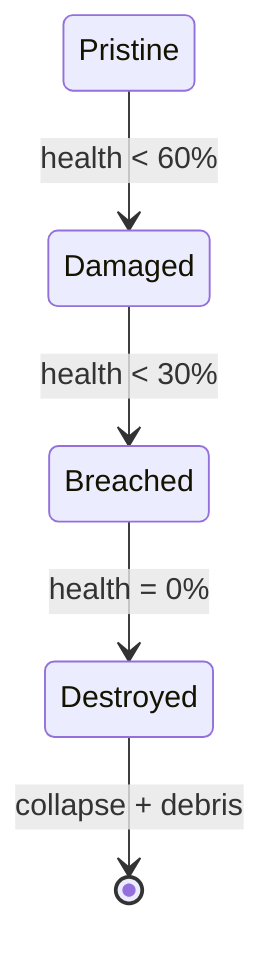

# Game Module: `destruction/` — Destruction System

**Path:** `crates/game/src/combat/destruction/`  
**Files:** 6 — `mod.rs`, `damage.rs`, `debris.rs`, `glass.rs`, `penetration.rs`, `vehicles.rs`  
**Purpose:** Enterprise material penetration, debris spawning, glass fracture, building collapse, vehicle damage

## Module Map

```
destruction/
├── mod.rs          — DestructionLevel, MaterialType, DestructionState, DestructionPlugin
├── damage.rs       — Explosion damage, state machine, collapse animation
├── debris.rs       — Debris entity spawning + lifetime management
├── glass.rs        — Glass fracture patterns + glass debris
├── penetration.rs  — MaterialPenetrationTable, bullet penetration system
└── vehicles.rs     — Vehicle damage state machine overlay
```

## DestructionPlugin

Registers:
- `DestructionTransitionMessage` message type
- `MaterialPenetrationTable` resource
- 7 systems in Update chain:
  1. `bullet_penetration_system`
  2. `apply_explosion_damage_system`
  3. `destruction_state_machine_system`
  4. `debris_lifetime_system`
  5. `glass_fracture_system`
  6. `glass_debris_lifetime_system`
  7. `vehicle_damage_state_system`
  8. `collapse_animation_system`

## DestructionLevel

```rust
pub enum DestructionLevel { Pristine, Damaged, Breached, Destroyed }
```

## MaterialType (14 variants)

```rust
pub enum MaterialType {
    Drywall, Wood, Plywood, SheetMetal,
    Brick, Concrete, ReinforcedConcrete,
    Sandbag, Glass, BulletproofGlass,
    CarDoor, CarEngine, Flesh,
}
```

## DestructionState Component

```rust
pub struct DestructionState {
    pub state: DestructionLevel,
    pub health: f32,
    pub max_health: f32,
    pub material: MaterialType,
    pub bullet_holes: Vec<Vec3>,
    pub debris_spawned: bool,
}
```

### Default Max Health Per Material
| Material | HP |
|----------|----|
| Drywall | 200 |
| Wood | 100 |
| Plywood | 80 |
| SheetMetal | 300 |
| Brick | 1,500 |
| Concrete | 2,000 |
| ReinforcedConcrete | 5,000 |
| Sandbag | 500 |
| Glass | 30 |
| BulletproofGlass | 200 |
| CarDoor | 200 |
| CarEngine | 500 |
| Flesh | 100 |

## State Machine



### Transition Thresholds
- **Pristine → Damaged:** Below 60% max_health
- **Damaged → Breached:** Below 30% max_health
- **Breached → Destroyed:** At 0% max_health

Each transition emits `DestructionTransitionMessage` and spawns appropriate debris.

## Key Systems

### bullet_penetration_system
Evaluates bullet impacts against material penetration tables. Determines if bullet passes through material and with what velocity reduction.

### apply_explosion_damage_system
Reads `GrenadeDetonatedMessage` and applies spherical falloff damage to all destructible entities within radius. Damage efficiency: 80% structural.

### destruction_state_machine_system
Monitors `DestructionState.health` and advances through state levels. Spawns debris on Breach and Destroyed transitions.

### collapse_animation_system
Applies downward velocity to debris entities when a structure enters Destroyed state.

### glass_fracture_system
Handles glass-specific fracture patterns with radial crack propagation.

### vehicle_damage_state_system
Specialized damage overlay for vehicles with component damage (engine, wheels, armor).
