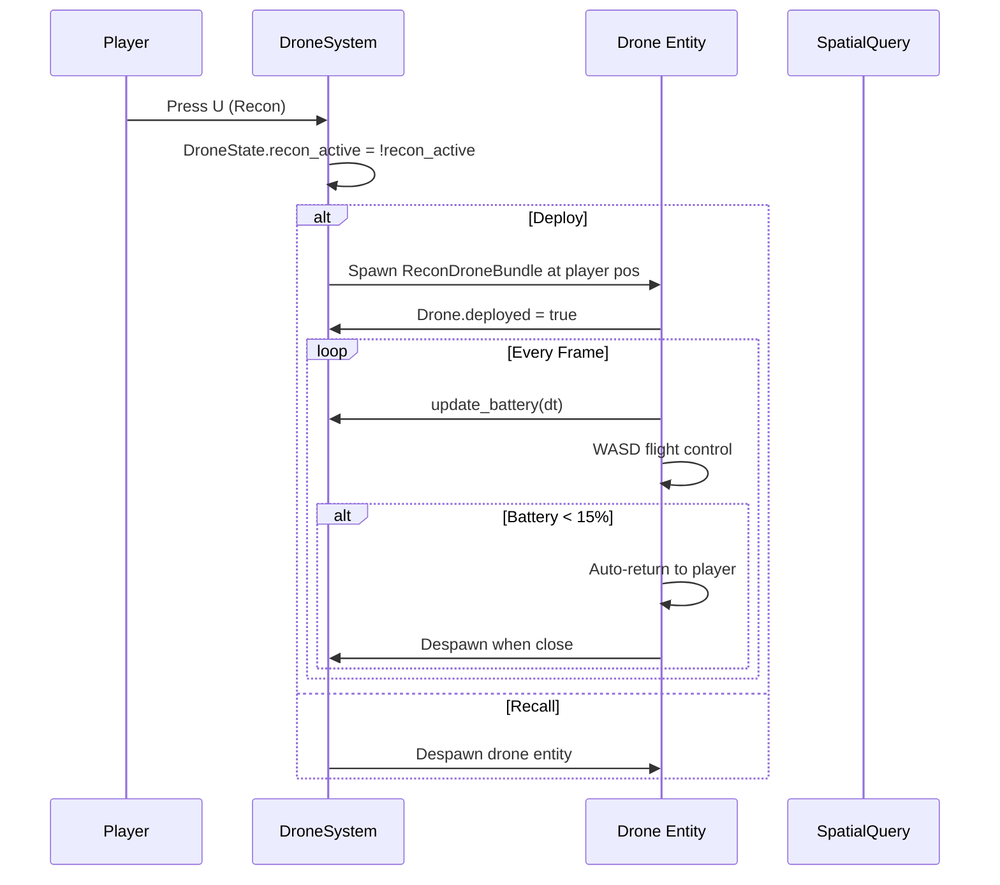

# Game Module: `drones/` — Drone Systems

**Path:** `crates/game/src/drones/`  
**Files:** 1 — `mod.rs`  
**Purpose:** 4 drone types with deployment, flight, battery management, and detonation

## Drone Types

| Type | Key | Battery | Speed | Altitude | Special |
|------|-----|---------|-------|----------|---------|
| **Recon UAV** | U | 120s | 8 m/s | 8m | Marks enemies, auto-return at 15% battery |
| **FPV Strike** | J | 30s | 25 m/s | 2m | Explosive, manual/proximity detonation |
| **Grenade Drone** | H | 60s | 15 m/s | 3m | 4 grenade hardpoints |
| **Mine Drone** | N | 90s | 10 m/s | 1.5m | 3 mines, dispense patterns |

## Drone Component

```rust
pub struct Drone {
    pub drone_type: DroneType,
    pub battery: f32,
    pub max_battery: f32,
    pub deployed: bool,
    pub speed_mult: f32,
    pub velocity: Vec3,
    pub marked_targets: Vec<Entity>,
    pub detonated: bool,
    pub explosion_radius: f32,
    pub explosion_damage: f32,
    pub grenade_hardpoints: u32,
    pub mine_count: u32,
}
```

## DroneState Resource
```rust
pub struct DroneState {
    pub recon_active: bool,
    pub fpv_active: bool,
    pub grenade_active: bool,
    pub mine_active: bool,
}
```

## Bundles
- `ReconDroneBundle` — Kinematic rigidbody, sphere collider, deployed=true
- `FpvDroneBundle` — Same structure, different collider radius
- `GrenadeDroneBundle` — With grenade hardpoints
- `MineDroneBundle` — With mine dispenser

## Systems (drone_control_system)

1. **Deployment:** U/J/H/N keys toggle drone active state
2. **Battery:** Drained at 3/s while deployed, recharged when docked
3. **Flight:** WASD/QE camera-relative movement with lerp acceleration
4. **FPV Detonation:** Space key manual detonation + proximity auto-detonation
5. **Recon Auto-Return:** Returns to player at 15% battery
6. **Explosion:** `apply_drone_explosion` — spherical damage via `SpatialQuery`

## Explosion System

```rust
pub fn apply_drone_explosion(
    &spatial_query, &mut damage_writer,
    center, radius, damage, exclude,
) {
    // Queries spatial_query.shape_intersections for entities within sphere
    // Writes DamageMessage for each hit entity
}
```

## Deployment Sequence


