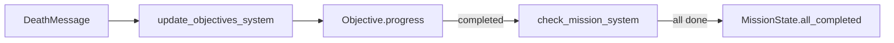

# Game Module: `missions/` — Mission System

**Path:** `crates/game/src/missions/`  
**Files:** 1 — `mod.rs`  
**Purpose:** Mission objectives and progress tracking

## ObjectiveType

```rust
pub enum ObjectiveType { EliminateAll, ReachLocation, DefendPosition, CollectIntel, Extract }
```

## Objective

```rust
pub struct Objective {
    pub objective_type: ObjectiveType,
    pub description: String,
    pub target_count: u32,
    pub current_count: u32,
    pub completed: bool,
    pub position: Option<Vec3>,
}
```

### Objective Lifecycle
1. Created with `target_count` requirement
2. `progress()` increments count, returns `true` if newly completed
3. `check_completion()` sets `all_completed` when all objectives done

## MissionState Resource

```rust
pub struct MissionState {
    pub objectives: Vec<Objective>,
    pub all_completed: bool,
    pub mission_name: String,
    pub briefing: String,
}
```

Default mission: "Training Exercise" — Eliminate 2 enemies.

## MissionPlugin

Registers `MissionState` resource + 2 Update systems:
1. `update_objectives_system` — Listens for `DeathMessage`, progresses EliminateAll objectives
2. `check_mission_system` — Sets `all_completed` flag

## Objective Progress Tracking


