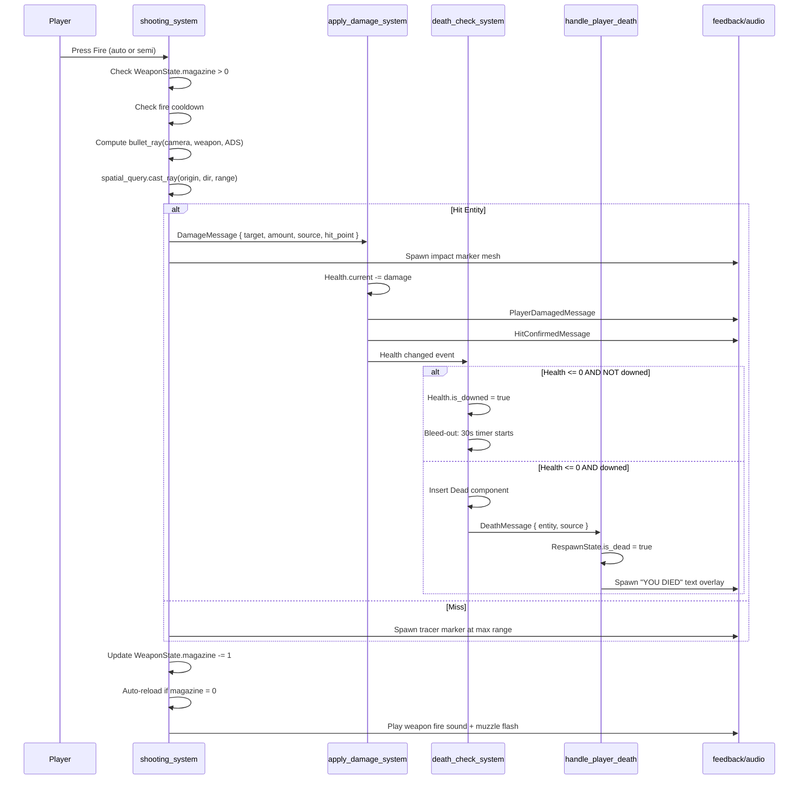
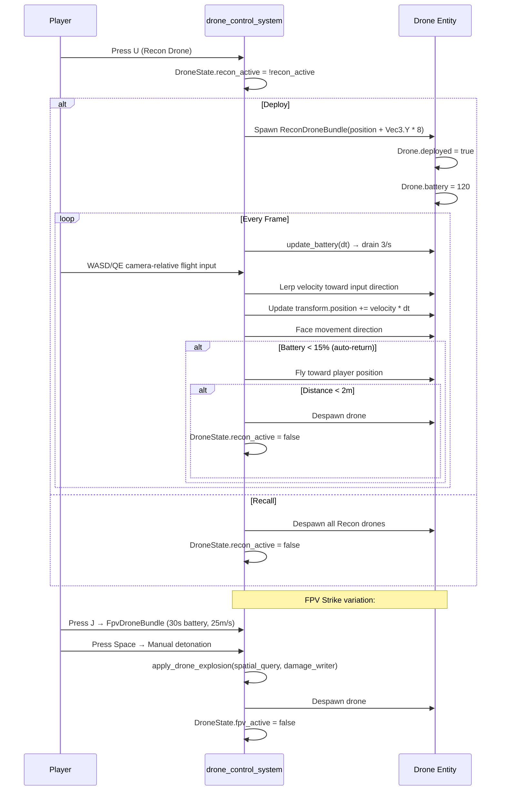
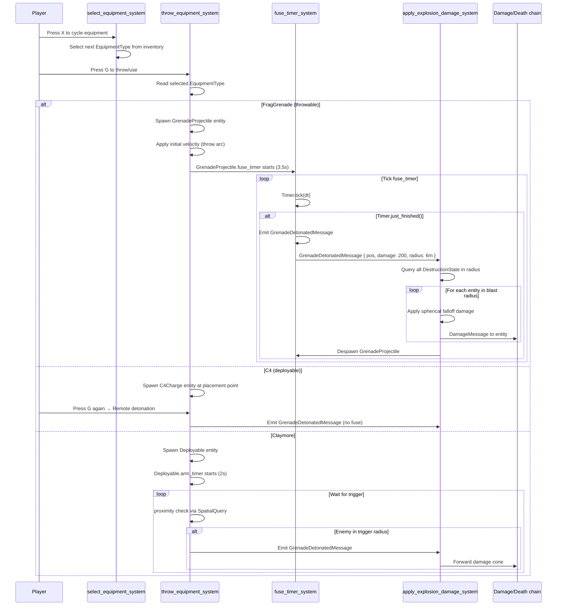
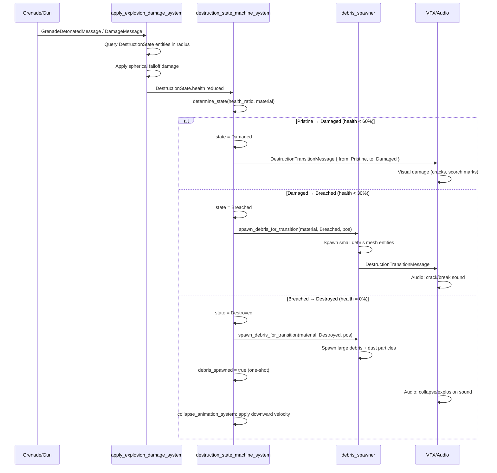
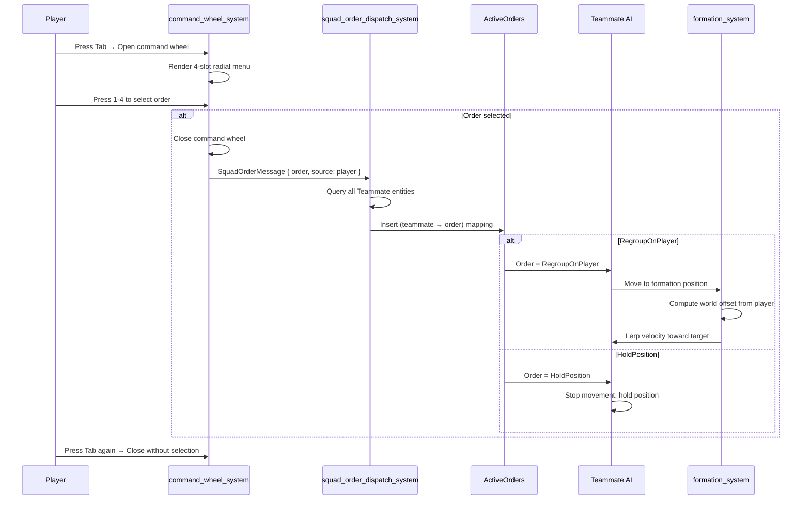
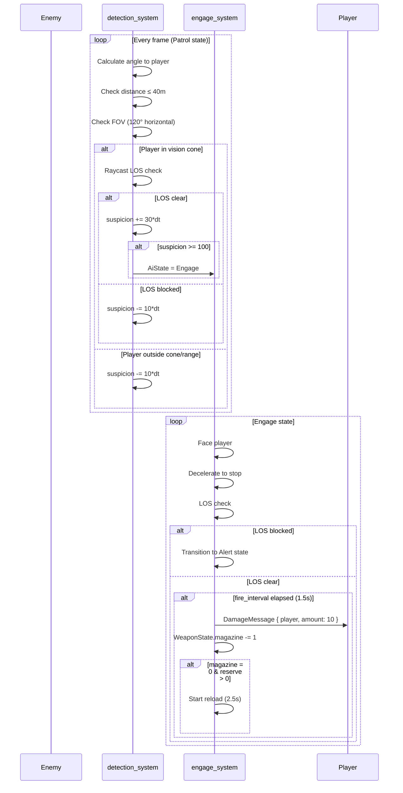

# SOCOM Tactical Shooter — Sequence Diagrams

## 1. Shooting → Damage → Death Flow

## 2. Drone Deployment → Flight → Detonation

## 3. Equipment Usage (Grenade)

## 4. Destruction State Machine

## 5. Squad Command System

## 6. AI Detection → Engagement

